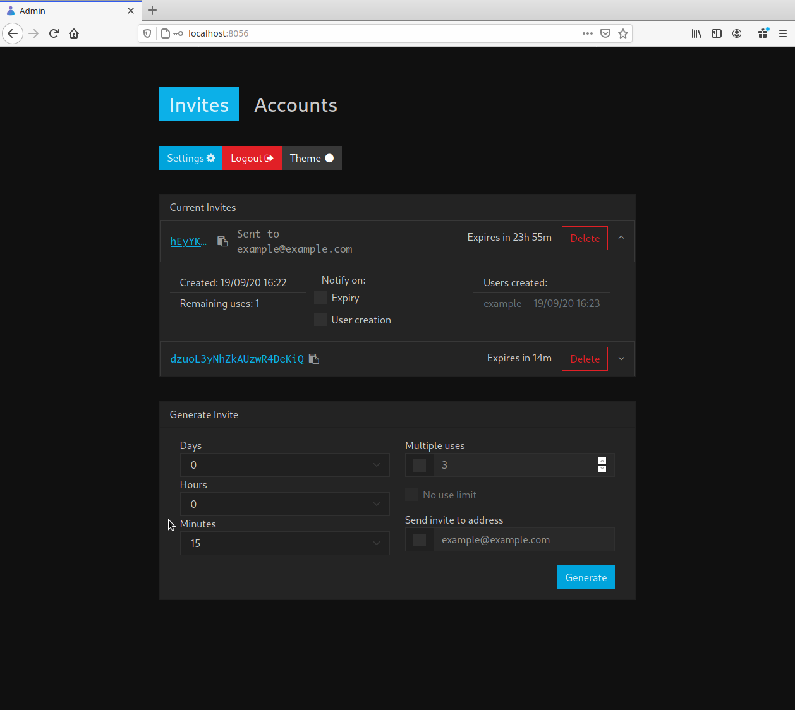
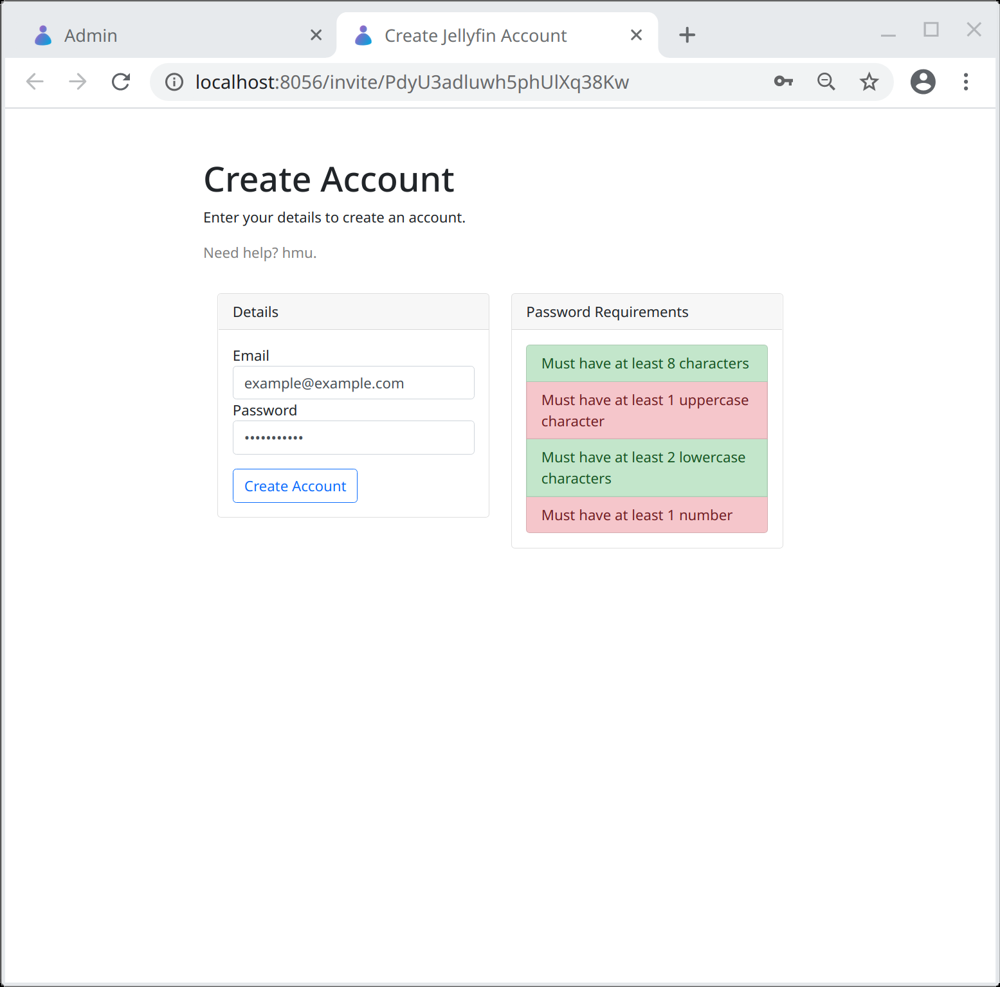
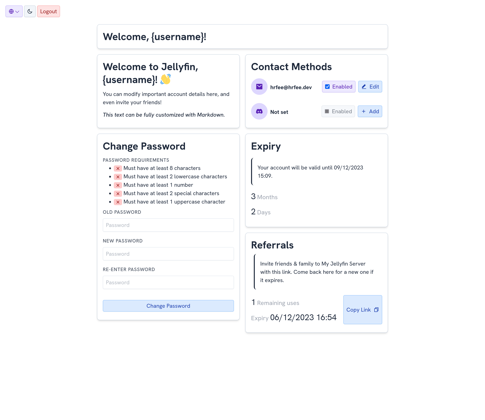

[](https://drone.hrfee.dev/hrfee/jfa-go)
[](https://hub.docker.com/r/hrfee/jfa-go)
[](https://weblate.jfa-go.com/engage/jfa-go/)
[](https://wiki.jfa-go.com)
[](https://discord.com/invite/MrtvuQmyhP)

##### Downloads:
##### [docker](#docker) | [debian/ubuntu](#debian) | [arch (aur)](#aur) | [other platforms](#other-platforms)

---
##  Project Status: Active-ish
Studies mean I can't work on this project a lot outside of breaks, however I hope i'll be able to fit in general support and things like bug fixes into my time. New features and such will likely come in short bursts throughout the year (if they do at all).

#### Does/Will it still work?
jfa-go currently works on Jellyfin 10.8.9, the latest version. I should be able to maintain compatability in the future, unless any big changes occur.

#### Alternatives
If you want a bit more of a guarantee of support, I've seen these projects mentioned although haven't tried them myself.

* [Wizarr](https://github.com/Wizarrrr/wizarr) focuses on invites, and also includes some Discord & Ombi integration.
* [Jellyseerr](https://github.com/Fallenbagel/jellyseerr) is a fork of Overseerr, which can manage users and mainly acts as an Ombi alternative.
* [Organizr](https://github.com/causefx/Organizr) doesn't focus on Jellyfin, but allows putting self-hosted services into "tabs" on a central page, and allows creating users, which lets one control who can access what.
---
jfa-go is a user management app for [Jellyfin](https://github.com/jellyfin/jellyfin) (and now [Emby](https://emby.media/)) that provides invite-based account creation as well as other features that make one's instance much easier to manage.

a rewrite of [jellyfin-accounts](https://github.com/hrfee/jellyfin-accounts) (original naming for both, ik 
😂).

#### Features
* 🧑 Invite based account creation: Send invites to your friends or family, and let them choose their own username and password without relying on you.
    * Send invites via a link and/or email
    * Granular control over invites: Validity period as well as number of uses can be specified.
    * Account profiles: Assign settings profiles to invites so new users have your predefined permissions, homescreen layout, etc. applied to their account on creation.
    * Password validation: Ensure users choose a strong password.
    * CAPTCHAs can be enabled to avoid bots
* ⌛ User expiry: Specify a validity period, and new users accounts will be disabled/deleted after it. The period can be manually extended too.
* 🔗 Ombi Integration: Automatically creates Ombi accounts for new users using their email address and login details, and your own defined set of permissions.
* Account management: Apply settings to your users individually or en masse, and delete users, optionally sending them an email notification with a reason.
* Telegram/Discord/Matrix Integration: Verify users via a chat bot, and send Password Resets, Announcements, etc. through it.
* "My Account" Page: Allows users to reset their password, manage contact details, view their account expiry date, and send referrals. Custom messages can be added, with markdown.
* Referrals: Users can be given special invites to send to their friends and families.
* 📨 Email storage: Add your existing users email addresses through the UI, and jfa-go will ask new users for them on account creation.
    * Email addresses can optionally be used instead of usernames
* 🔑 Password resets: When users forget their passwords and request a change in Jellyfin, jfa-go reads the PIN from the created file and sends it straight to them via email/telegram.
  * Can also be done through the "My Account" page if enabled.
* Admin Notifications: Get notified when someone creates an account, or an invite expires.
* 📣 Announcements: Bulk message your users with announcements about your server.
* Authentication via Jellyfin: Instead of using separate credentials for jfa-go and Jellyfin, jfa-go can use it as the authentication provider.
    * Enables the usage of jfa-go by multiple people
* 🌓 Customizations
    * Customize emails with variables and markdown
    * Specify contact and help messages to appear in emails and pages
    * Light and dark themes available

#### Interface
<p align="center">
    </img>
    </img> 
    </img>
    </img> 
</p>

#### Install

**Note**: `TrayIcon` builds include a tray icon to start/stop/restart, and an option to automatically start when you log-in to your computer. For Linux users, these builds depend on the `libappindicator3-1`/`libappindicator-gtk3`/`libappindicator` package for Debian/Ubuntu, Fedora, and Alpine respectively.

##### [Docker](https://hub.docker.com/r/hrfee/jfa-go)
```sh
docker create \
             --name "jfa-go" \ # Whatever you want to name it
             -p 8056:8056 \
            # -p 8057:8057 if using tls
             -v /path/to/.config/jfa-go:/data \ # Path to wherever you want to store the config file and other data
             -v /path/to/jellyfin:/jf \ # Path to Jellyfin config directory, ignore if using Emby
             -v /etc/localtime:/etc/localtime:ro \ # Makes sure time is correct
             hrfee/jfa-go # hrfee/jfa-go:unstable for latest build from git
```

##### [Debian/Ubuntu](https://apt.hrfee.dev)
```sh
sudo apt-get update && sudo apt-get install curl apt-transport-https gnupg
curl https://apt.hrfee.dev/hrfee.pubkey.gpg | sudo apt-key add -

# For stable releases
echo "deb https://apt.hrfee.dev trusty main" | sudo tee /etc/apt/sources.list.d/hrfee.list
# ------
# For unstable releases
echo "deb https://apt.hrfee.dev trusty-unstable main" | sudo tee /etc/apt/sources.list.d/hrfee.list
# ------

sudo apt-get update

# For servers
sudo apt-get install jfa-go
# ------
# For desktops/servers with GUI (has dependencies)
sudo apt-get install jfa-go-tray
# ------
```

##### Arch
Available on the AUR as:
* [jfa-go](https://aur.archlinux.org/packages/jfa-go/) (stable)
* [jfa-go-bin](https://aur.archlinux.org/packages/jfa-go) (pre-compiled, stable)
* [jfa-go-git](https://aur.archlinux.org/packages/jfa-go-git/) (nightly)

##### Other platforms
Download precompiled binaries from:
 * [The releases section](https://github.com/hrfee/jfa-go/releases) (stable)
 * [Buildrone](https://builds.hrfee.dev/view/hrfee/jfa-go) (nightly)

unzip the `jfa-go`/`jfa-go.exe` executable to somewhere useful.
* For \*nix/macOS users, `chmod +x jfa-go` then place it somewhere in your PATH like `/usr/bin`.

Run the executable to start.


#### Build from source
If you're using docker, a Dockerfile is provided that builds from source.

Otherwise, full build instructions can be found [here](https://wiki.jfa-go.com/docs/build/).

#### Usage
Simply run `jfa-go` to start the application. A setup wizard will start on `localhost:8056` (or your own specified address). Upon completion, refresh the page.

```
Usage of jfa-go:
  start
	start jfa-go as a daemon and run in the background.
  stop
	stop a daemonized instance of jfa-go.
  systemd
	generate a systemd .service file.

  -config, -c string
    	alternate path to config file. (default "/home/hrfee/.config/jfa-go/config.ini")
  -data, -d string
    	alternate path to data directory. (default "/home/hrfee/.config/jfa-go")
  -debug
    	Enables debug logging.
  -help, -h
    	prints this message.
  -host string
    	alternate address to host web ui on.
  -port, -p int
    	alternate port to host web ui on.
  -pprof
    	Exposes pprof profiler on /debug/pprof.
  -swagger
    	Enable swagger at /swagger/index.html
```

#### Systemd
jfa-go does not run as a daemon by default. Run `jfa-go systemd` to create a systemd `.service` file in your current directory, which you can copy into `~/.config/systemd/user` or somewhere else.

---

If you're switching from jellyfin-accounts, copy your existing `~/.jf-accounts` to:

* `XDG_CONFIG_DIR/jfa-go` (usually ~/.config/jfa-go) on \*nix systems, 
* `%AppData%/jfa-go` on Windows,
* `~/Library/Application Support/jfa-go` on macOS.

(or specify config/data path  with `-config/-data` respectively.)

#### Contributing
See [the wiki page](https://wiki.jfa-go.com/docs/dev/) or [CONTRIBUTING.md](https://github.com/hrfee/jfa-go/blob/main/CONTRIBUTING.md).
##### Translation
[](https://weblate.jfa-go.com/engage/jfa-go/)

For translations, use the weblate instance [here](https://weblate.jfa-go.com/engage/jfa-go/). You can login with github.

#### Sponsors
Big thanks to those who sponsor me. You can see them below:

[](https://sponsors-endpoint.hrfee.pw/sponsor/profile/0)
[](https://sponsors-endpoint.hrfee.pw/sponsor/profile/0)
